# Communications - Lab Logbook

## Lab 1 - Introduction to LabView

### Exercise 1 - Data Types in LabView

This exercise involved converting between some of the basic data types in LabView. Specifically, we converted each letter of a string into its ASCII binary representation, which was shown in its equivalent unsigned integer form. We then treated each integer as a Fahrenheit temperature, converted it to Celcius, took an average and compared to a threshold value. We finally indicated if the string inputted was considered "Hot".

First, we opened LabView, created a new project and a new VI `DataTypes.gvi`.

In the **Diagram tab** of the main window, we added the **String to Byte Array** module from the function palette. We then added a control as an input and an indicator at the output.

Adding these items in the panel tab, we can view the byte array in the form of unsigned integers representing the ASCII values of each character of the string we input. For example, when we input the string `Hello`, we got the following output:

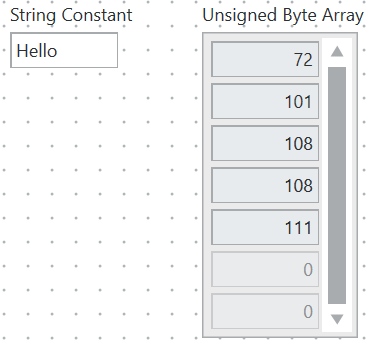

This is because the ASCII symbol `H` corresponds to ASCII code `72` in decimal, `e` corresponds to ASCII code `101` in decimal, `l` corresponds to ASCII code `108` and so on.

We then considered the decimal ASCII code to be a temperature in Fahrenheit. We then converted this to a temperature in Celcius by using the following formula:

$$\degree \text{C} = (\degree \text{F} - 32) \div 1.8 $$

We therefore added a subtraction and division block to our diagram. 

Next we wanted to calculate the average of the array of converted temperatures. We added the **Add Array Elements** (essentially sums all the non-zero elements of the array up) and the **Array Size** blocks to our diagram as well as another diviison block. We then connected the output of the **Add Array Elements** block to the dividend input of the division block and the output of the **Array Size** to the divisor input of the division block. We also created an output indicator showing the average temperature.

Finally, we applied a threshold using the **Greater or Equal** module, setting the constant to $50$ and comparing the average value to this constant. We then added a boolean indicator `Hot?` as the output of the **Greater or Equal** module.

In summary: we input a string, receieve an array of ASCII codes corresponding to each character of the string, we then consider these integers to be temperatures in Fahrenheit and convert these values to Celcius, find the average and then compare with $50$. If the average temperature in Celcius is greater than or equal to $50$, the boolean indicator `Hot?` is true (lights up blue in the panel).

We then tested this by inputting both our surnames in the `String Constant` field:

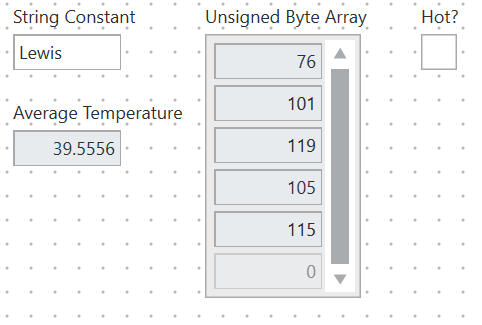

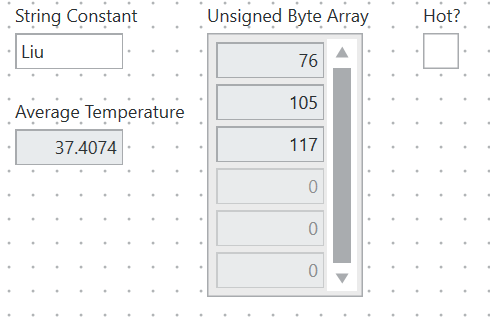

Rearranging the above equation for $\degree \text{F}$, we get:

$$ \degree \text{F} = (\degree \text{C} \times 1.8) + 32 $$

And since our threshold is $50$, we set $\degree \text{C} = 50$ and so the minimum ASCII character code to exceed the threshold is $122$ which corresponds to the ASCII symbol `z`:

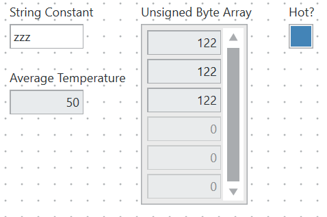

And hence the indicator `Hot?` is True and lights up blue in the panel.

---

### Exercise 2 - Implementation of the Central Limit Theorem (CLT)

In this exercise we visualise the CLT. We generate independent, uniformly distributed random numbers, and the convergence of the sample mean value to a normal distribution will be observed as the number of 
trials increases. 

First, we created a new VI called `CLT.gvi`. What we want to do is to generate a vector of iid random numbers (which we will do with a for loop), evalulate their sample mean and iterate this whole process within a while loop. After each iteration of the while loop, we wlil update the histogram of the mean values to observer hte convergence of the distribution.

First, we added a **While Loop** in the diagram. This contains an iteration output which tells us the current iteration in the loop, as well as as conditional terminal which allows us to terminate the loop if a certain condition is met. Initially, we just connected a **Stop** control input to this. Within the while loop, we also added the **Wait** module which acts as a delay between each iteration of the loop.

Within the while loop, we then added 2 nested for loops, connecting constants to both loop count terminal of each. This defines how large our 2D array will be. Initially we set this to $5$ for both.

Within the for loops, we placed a **Random Number** generator block, and connected its output to an **Add Array Elements** block. As data is transferred from within a loop to outside a loop, it does so via a tunnel. In our case, we used an **auto-indexing** output tunnel which appends the values obtained from a single loop iteration to an increasing array of data.

We then calculated the mean value by dividing the output of the **Add Array Elements** block by the total number of elements in the array, which in our case was $5 \times 5 = 25$.

Next, we created an array of these sample means to obtain a histogram. We placed an **Insert into Array** function on the block diagram outside the for loops but within the while loop which inserts each sample mean into a specific position in the array. In our case, we used the iteration of the while loop to index into this block.

We also needed to add a base array to add all these new elements to, and it needs to be available 
at each iteration. To do this, we use a shift 
register which is a type of tunnel that carries information from one iteration to the next. First, we
connected the output array of the **Insert into Array** function to the right frame of the While loop. This creates a tunnel by default.

We then right clicked on the tunnel and select **"Change with Shift Register"**. This created another tunnel on the left frame of the loop. We then connected this new tunnel to the **"array"** terminal of the **Insert into Array** function. The tunnel on the left edge carries the data from the previous 
iteration, whereas the one on the right edge sends the data to the next iteration.

Finally, for the **"input"** terminal of the left register, we created a constant array so it can initialise the program with an array of 0s. We then also added the histogram block with an output indicator and a control input for **"number of bins"**. 

The **number of bins** refers to the number of intervals into which the data range is divided. Each bin represents a specific range of values and the height of the bin indicates how many data points fall within that range. For example, if we have data ranging from $0$ to $100$, if we have $4$ bins, each bin might cover: $0$-$25$, $25$-$50$, $50$-$75$ and $75$-$100$.

This was our final block diagram:

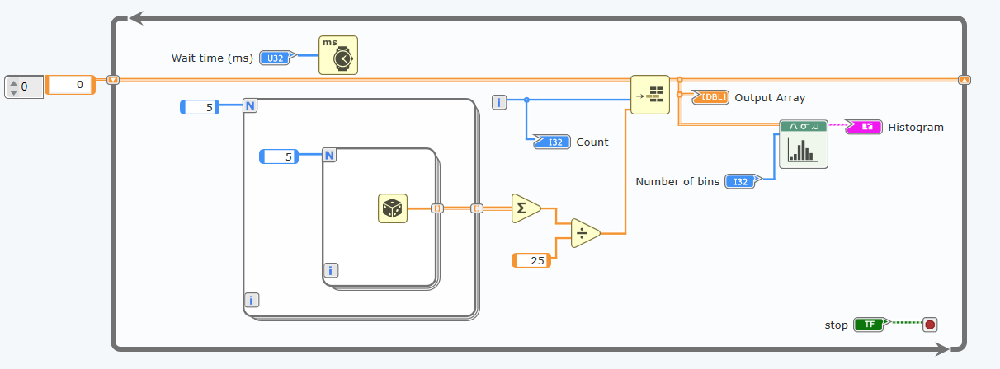

We then ran the program, setting wait time to $10$ ms and number of bins to $100$. We let the program run for roughly $5000$ simulations before stopping it and this was the resulting histogram:

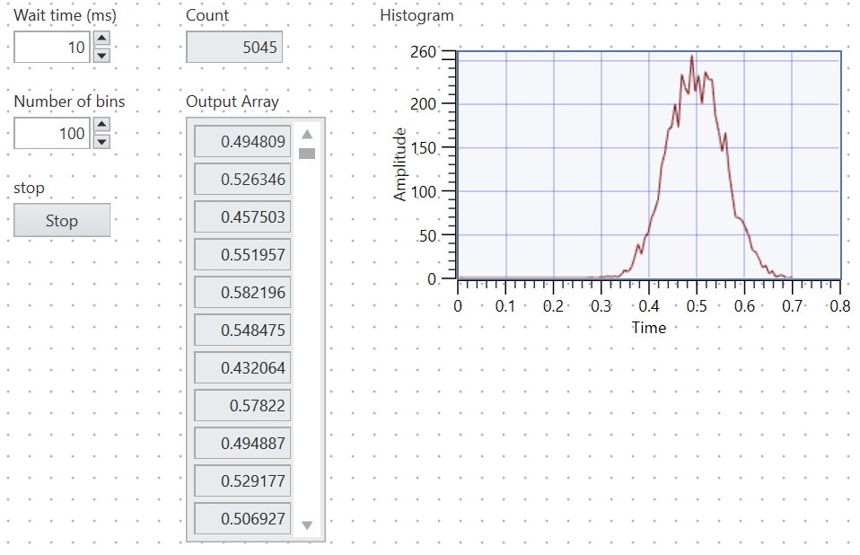

We then created a control for stopping the execution of the program after 1000 iterations. This just involved adding an **Equal** block and comparing the iteration number to a constant 1000:

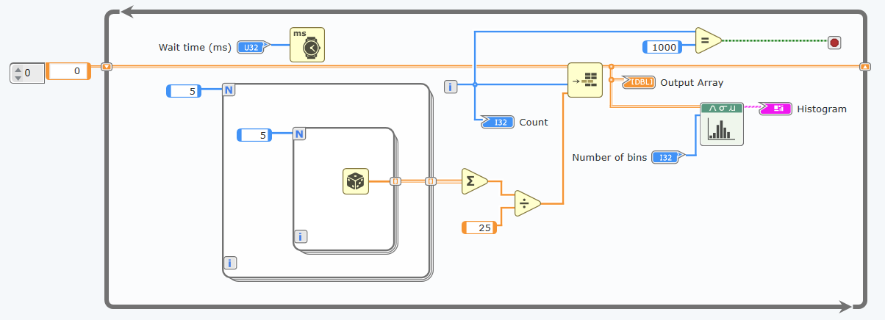

We then ran the program again, this time setting the number of bins to 10. Notice that the histogram is more generalised and appears more smooth as the data range of each interval is greater so we see less detail. This time, the count automatically stopped at 1000.

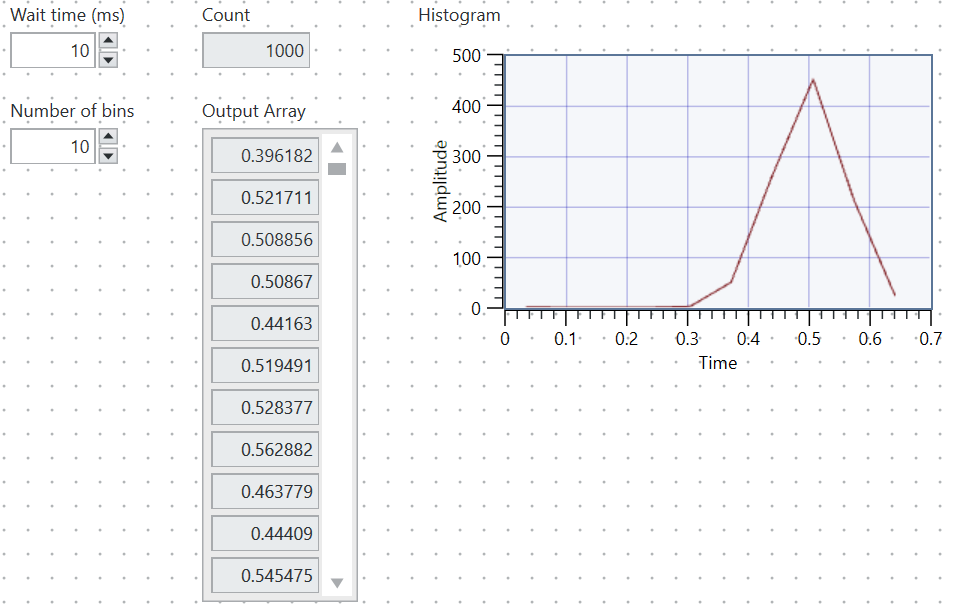

Finally, we revised the code such that the final distribution we see is a standard normal distribution (zero mean and unit variance). We know that the random number generator follows a **continuous uniform distribution** $U(0,1)$, meaning all values in that range are equally likely to be generated.

We know that the mean $\mu$ of a continuous uniform distribution is: 

$$\mu=\dfrac{\alpha + \beta}{2}$$

where in our case, $\alpha = 0$ and $\beta = 1$ and thus $\mu = 0.5$.

We also know that the variance of a continuous uniform distribution is:

$$\sigma ^ 2=\dfrac{(\beta - \alpha)^2}{12}$$

which means $\sigma=\dfrac{1}{\sqrt{12}}$.

Finally, we know that if $X \sim N(\mu , \sigma ^2)$, then the standard normal distribution is given by $Z=\dfrac{X-\mu}{\sigma} \sim N(0,1)$.

Therefore we have to subtract $\mu = 0.5$ from each value and then divide this by $\sigma = \dfrac{1}{\sqrt{12}}$.

This can be done easily by just adding an additional subtract block, two division blocks and a square root block:

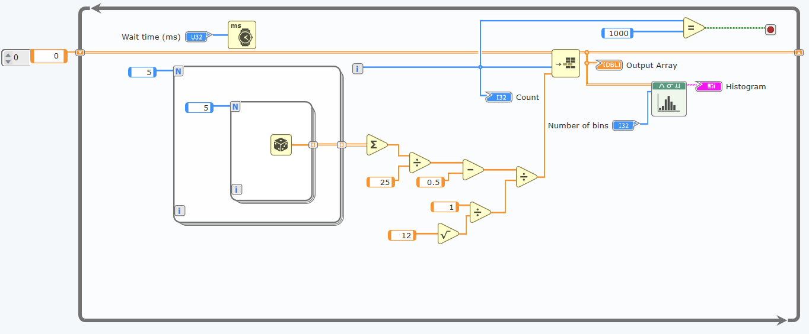

We then set the number of bins to 20 which seemed like a good balance between a smooth distribution whilst also maintaining a reasonable level of detail and we got the following distribution:

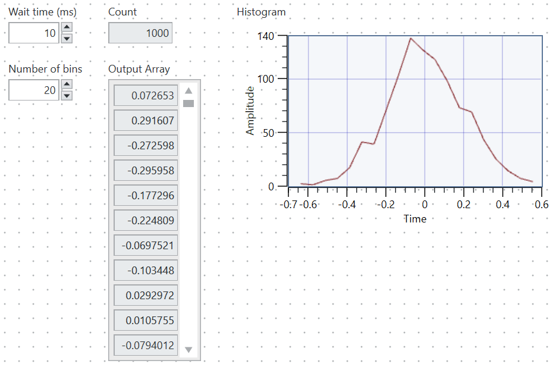

Clearly, we can see that the distribution is centered around 0 (i.e. $\mu = 0$) and the variance appears to be roughly 1 as it looks like around 66% of the data is within 0.5 either side of the mean.

We also ran a final test with 20,000 iterations and 50 bins, and we observed a distribution that was very similar to a standard normal distribution:

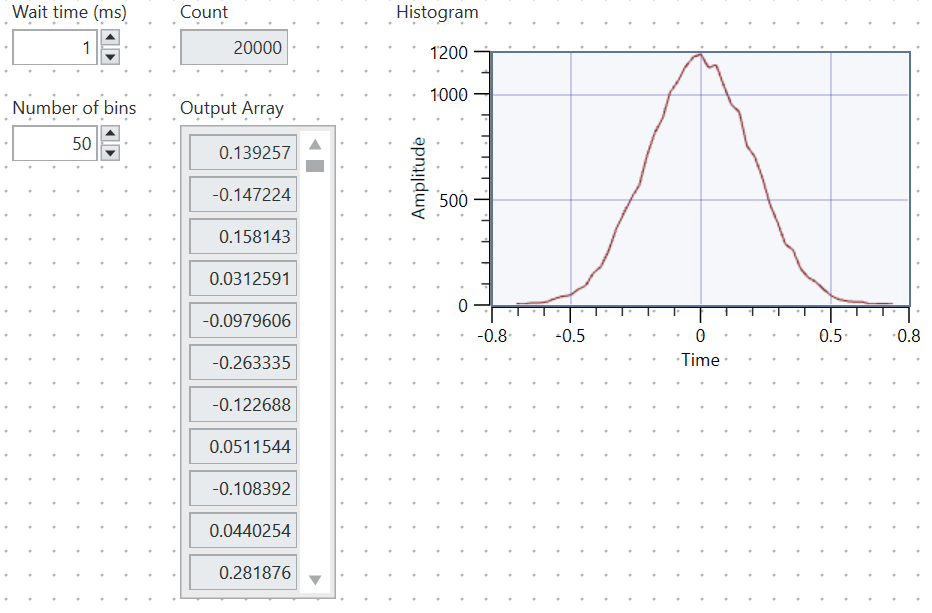

---

### Exercise 3 - AM Modulator

In this exercise, we built an AM Modulator. We know that the equation for modulating a single tone (single-frequency signal) is given by:

$$ s(t)=[A_c + A_m \cos(2 \pi f_m t)]\cos(2 \pi f_c t) $$

where $A_m$ and $A_c$ are the amplitudes, and $f_m$ and $f_c$ are the frequencies of the message and carrier waveforms respectively.

First, we created a new VI called `AM.gvi` and using the **Wave Generator** module, we created two **Sine waveforms** corresponding to the message and carrier waveforms. We created controls for frequency, amplitude, sample rate and samples for each waveform.

We then assigned values to the terminals of the waveform generators. We set the sample rate of both the carrier and message signal to $200 \text{k}$ which is the number of samples generated per second. A higher sample rate improves the resolution but requires more processing power. We also set the samples to $1000$ which means there are $1000$ discrete points that make up the waveform. So, with a $200 \text{kHz}$ sample rate and $1000$ samples, we generate a waveform lasting $5 \text{ms}$.

$t_0$ (which is the starting time of the waveform) was also set to epoch which refers to time 0 in a given reference system which is useful for synchronising waveforms across systems. In our case, epoch was 01/01/1904, 00:00.

We then added the **FFT Power Spectrum and PSD** module to the diagram. This module analyses the frequency content of a signal using the FFT. The Power Spectrum computes the magnitude squared of the FFT, representing the power present at each frequency component:

$$ P(f)=|X(f)|^2 $$

Switching the module to **PSD**, the power spectrum is simply normalised by the frequency resolution $\Delta f$, i.e. the **frequency bin width**:

$$ \text{PSD}(f)=\dfrac{|X(f)^2|}{\Delta f} $$

Changing to PSD is useful as it gives a density which is useful when comparing power between different signals.

Finally, we performed some multiplication, division and addition operations to obtain the AM waveform. From AM theory:

$$ s(t)= [A_c + A_m \cos(2 \pi f_m t)]\cos(t \pi f_c t) $$

which can be rewritten as:

$$ s(t) = \frac{1}{A_c}[A_m\cos(2 \pi f_m t)][A_c\cos(2 \pi f_c t)]+ A_c\cos(2 \pi f_c t) $$

and so we therefore had a **Multiply (Waveform)** module which multiplied the message and carrier waveforms, a **Divide (Waveform)** module to divide by $A_c to remove the extra scaling factor $A_c$ and finally we used an **Add (Waveform)** module to add the carrier component to the result. We then created an indicator to show the AM waveform and PSD. We also created a Sub-VI for the AM module.

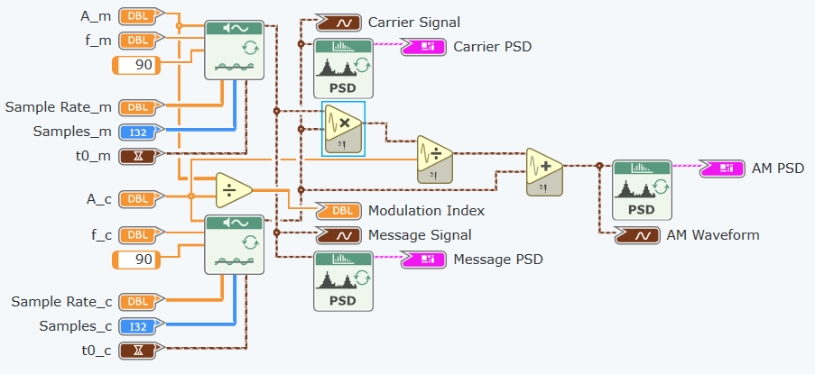

We also know that the modulation index, $\mu$ is defined as $\mu=\frac{A_m}{A_c}$. The modulation index can be changed by adjusting $A_c$ and $A_m$ in the panel and this defines how much the carrier amplitude varies according to the message amplitude.

First, we set $A_c=2$ in the panel, and changed $A_m$ to obtain modulation index values $\mu=\{0.5, 1, 1.5\}$ which corresponded to $A_m=\{1, 2, 3\}$ respectively. These were the plots of the time domain and PSD representation of the message, carrier and modulated signals for each value of $\mu$.

$\mu=0.5$:
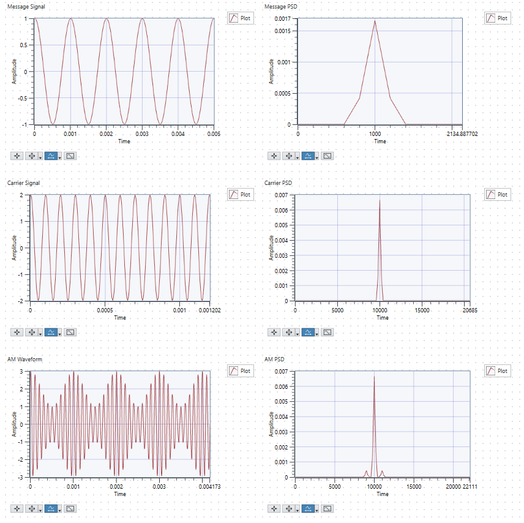

$\mu=1$:
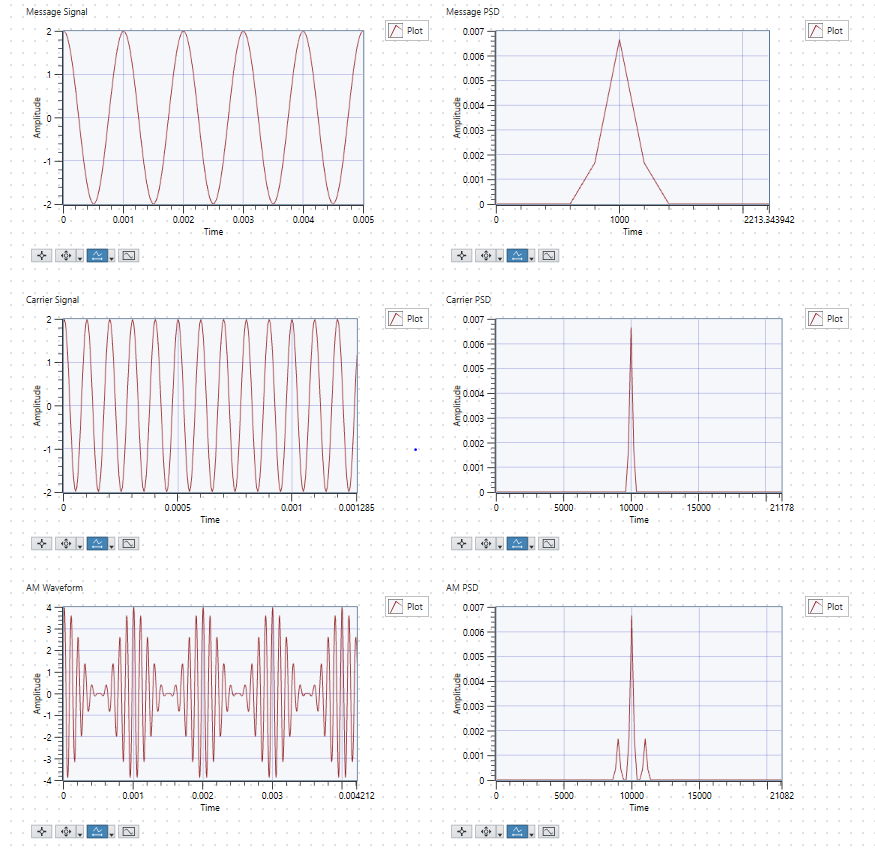

$\mu=1.5$:
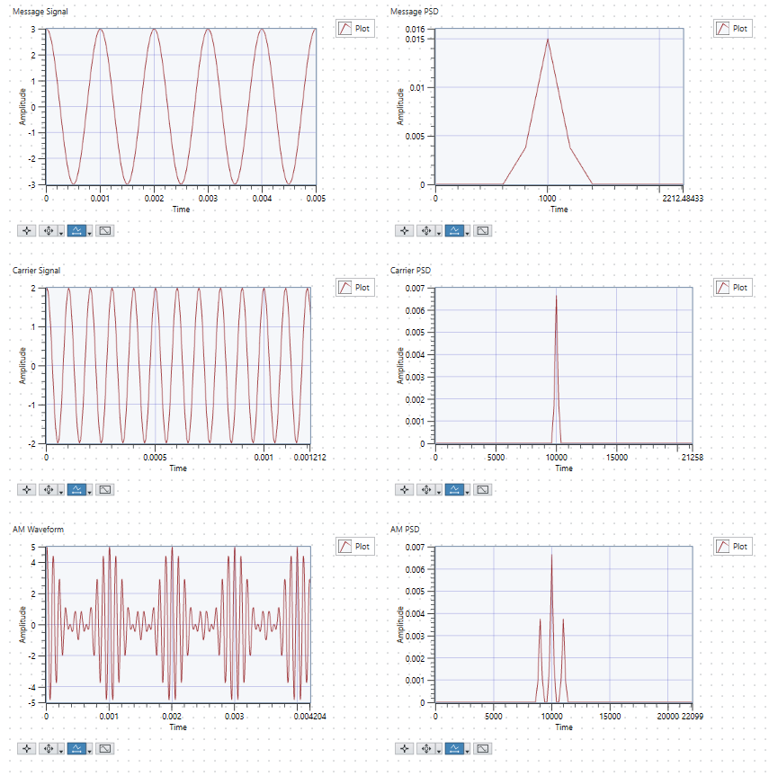

We see that for all the modulation indexes above, the envelope of the AM waveform is generated by the message signal. For $\mu=0.5$, the carrier amplitude varies by 50% above and below the unmodulated level (which is 2, hence why the amplitude varies between 1 and 3), and as such the amplitude of the AM signal never reaches 0. In short, the amplitude variation is smaller than the carrier's original amplitude. This is a case of an under-modulated signal ($\mu < 1$).

For $\mu=1$, the carrier amplitude varies by 100% above and below the unmodulated level, i.e. the amplitude varies exactly between 0 and twice the carrier amplitude which is 4. This is critical modulation and this yields the highest SNR.

For $\mu=1.5$, the envelope crosses 0 and inverts, leading to envelope distortion. This signal is over-modulated ($\mu > 1$). In this case, a receiver may struggle to properly demodulate the signal as it cannot simply follow the envelope of the message.

To summarise, as $\mu$ increase, the depth of the amplitude variation increases.

We also see from the PSD of the AM signals that there are three main components visible: the **carrier frequency** $f_c$ azt the centre, the **upper sideband (USB)** at $f_c+f_m$ and the **lower sideband (LSB)** at $f_c-f_m$, and it is the sidebands that contain the actual message information.

For $\mu=0.5$ (under-modulated), the sidebands are present but have low energy. This is because the carrier remains dominant meaning most of the power is in the carrier rather than the message (inefficient power usage).

For $\mu=1$ (critical modulation), the sidebands have equal power. We know that the total transmitted poewr in AM is:

$$ P_{total}=P_c+P_{USB}+P_{LSB} $$

and at critical modulation, the power in the sidebands together equals 50% of the total power, i.e. the total sideband power is equal to the carrier power:

$$ P_{USB}=P_{LSB}=\dfrac{P_c}{2} $$

$$ P_{USB}+P_{LSB}=P_c=\dfrac{P_{total}}{2} $$

For $\mu=1.5$ (over-modulated), the sidebands have more energy but nonlinear distortion occurs, introducing frequency components (harmonics). 

Finally, we set $A_c=A_m=1$ ($\mu=1$) and changed the frequency of the message signal $f_m=\{1\text{k}, 2\text{k}, 5\text{k}\}$ and these were the plots we obtained at each frequency:

$f_m=1\text{kHz}$:
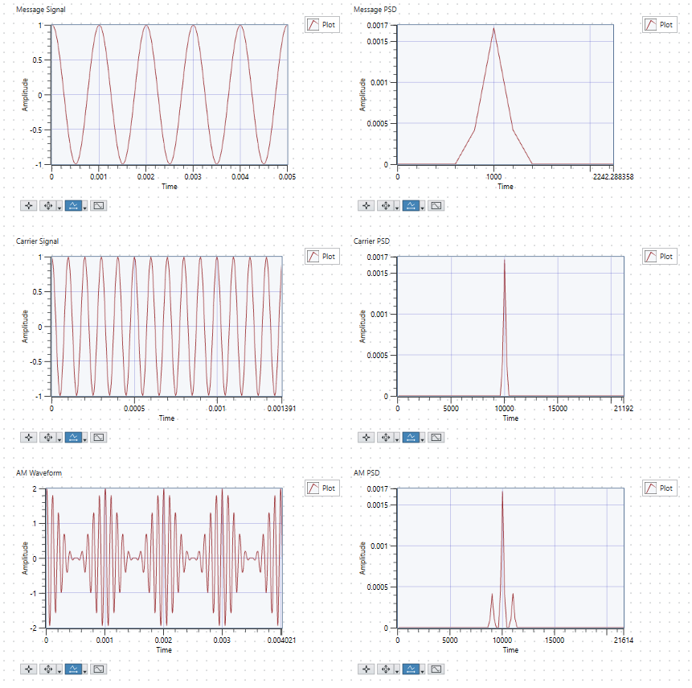

$f_m=2\text{kHz}$:
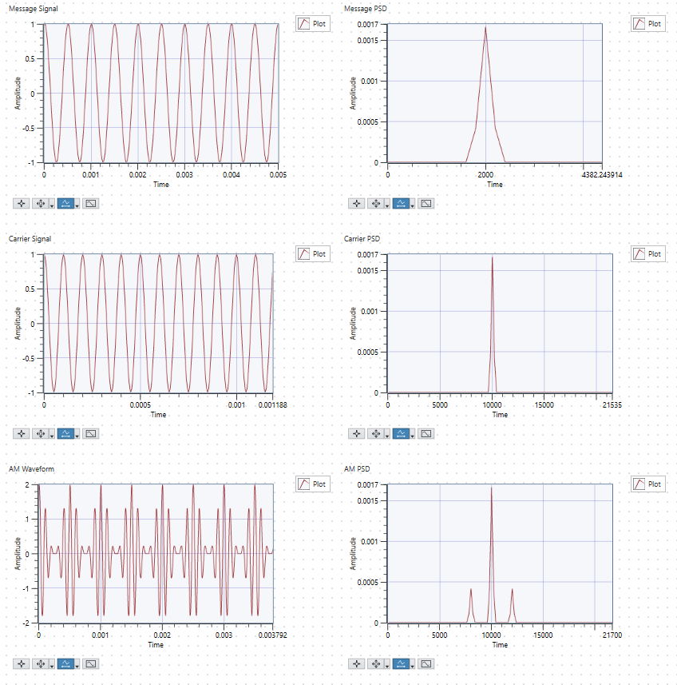

$f_m=5\text{kHz}$:
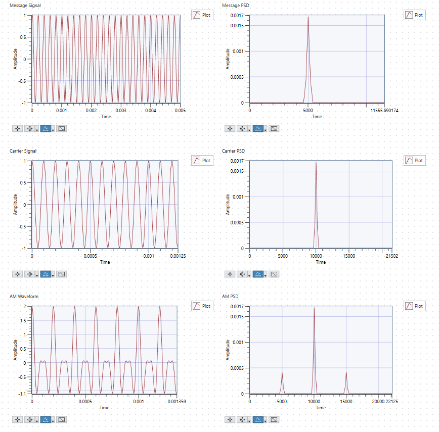

We can clearly see from these plots that as the message frequency $ f_m $ increases, the envelope oscillates faster. We also see that the time domain waveforms at $2\text{kHz}$ and especially $5\text{kHz}$ have significant distortion. We also see the sidebands move further away from the central carrier frequency, which increases the required bandwidth ($ B=2f_m $).

The distortion is likely due to aliasing/sampling issues where our sample rate is not high enough. In a real system, there may also be a bandwidth limitation that would affect this.

# Lab 2

## Exercise 1a: Coherent Detection

The formula for AM applied on a single tone signal (a signal that consists of a single frequency) is given by:

$s(t) = [A_c + A_m \cos(2\pi f_m t)] \cos(2\pi f_c t)$

**Parameters:**

$A_m =$ Message Amplitude 
$A_c =$ Carrier Amplitude 
$f_m =$ Message Frequency 
$f_c =$ Carrier Frequency 

**Coherent Demodulation:** Coherent demodulation involves multiplying the received AM signal with a synchronized carrier signal of the same frequency and phase. This process shifts the signal to baseband. A low-pass filter is then used to remove high-frequency components, leaving the original message signal for further processing.

**Envelope detection:** Envelope detection rectifies the AM signal to convert it to a unipolar form. A low-pass filter is then applied to smooth out the high-frequency components, capturing the signal's amplitude variations. Finally, the DC component is removed to extract the original message signal.

### Task 1: Add the block diagram to your logbook.
The block diagram for the coherent demoulation is shown:

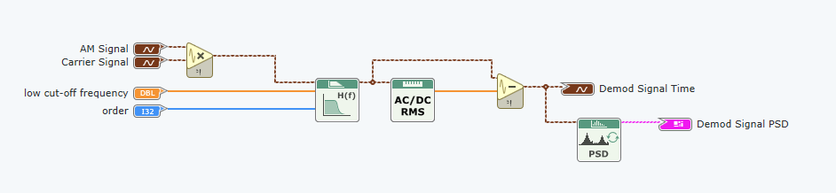

This is the process for demodulation of an AM signal through coherent method, the AM signal is multiplied by the carrier signal and the output of that is put through a low pass butter worth filter. Then the DC offset is subtracted away from that which arises due to a possibility of phase offset or amplitude mismatch, the product signal can contain a residual DC component or an unwanted low-frequency component.

1. **Multiply AM Signal by Local Carrier**  
    Let the AM signal be $x(t) = [A + m(t)] \cos(\omega_c t)$.

    Multiply it by a local carrier $\cos(\omega_c t)$:
     $$
     x(t) \cdot \cos(\omega_c t) = [A + m(t)] \cos^2(\omega_c t).
     $$
   
2. **Apply Trig Identity** 
    Using $\cos^2(\theta) = \frac{1}{2} + \frac{1}{2}\cos(2\theta)$:
     $$
     [A + m(t)] \cos^2(\omega_c t)
     = \frac{A + m(t)}{2} + \frac{A + m(t)}{2} \cos(2\omega_c t).
     $$

3. **Low-Pass Filter**  
    A low-pass filter removes the high-frequency term $\cos(2\omega_c t)$, leaving:
     $$
     \frac{A + m(t)}{2}.
     $$
    This is essentially the baseband signal $m(t)$ plus a DC offset.

4. **AC/DC RMS (Offset Removal / Signal Measurement)**  
    The AC/DC RMS block can remove the DC offset or provide an amplitude measurement of the recovered signal, yielding a cleaner baseband output.

5. **Demodulated Output & PSD**  
    The final output labeled *Demod Signal Time* is the recovered message $m(t)$.
    A *PSD* (Power Spectral Density) block can be used to visualize the frequency content of the demodulated signal.

**Butterworth Filter**

The butterworth filter is a low pass filter which lets the frequencies below the cutoff frequency through with little attentuation and rolls off above that frequency, the higher the order, the steeper the roll off but introduces more delay.

### Task 2: Explain briefly the mathematical theory behind this demodulation technique. Moreover, why are we using a low pass filter and why do we have to get rid of the DC component? Why do you need to scale the message amplitude?

In coherent demodulation of Amplitude Modulation (AM), the received signal $r(t)$ can be represented as:

$$
r(t) = [A_c + m(t)] \cos(\omega_c t)
$$

where:
- $A_c$ is the amplitude of the carrier.
- $m(t)$ is the message (baseband) signal.
- $\omega_c$ is the angular frequency of the carrier.

To demodulate, the received signal is multiplied by a locally generated carrier signal (coherent carrier) of the same frequency and phase:

$$
y(t) = r(t) \cdot \cos(\omega_c t) = [A_c + m(t)] \cos^2(\omega_c t)
$$

Using the identity $\cos^2(x) = \frac{1 + \cos(2x)}{2}$, we have:

$$
y(t) = \frac{1}{2}[A_c + m(t)] + \frac{1}{2}[A_c + m(t)] \cos(2\omega_c t)
$$

This result has two main components:

- Baseband component:: $\frac{1}{2}[A_c + m(t)]$
- High-frequency component: $\frac{1}{2}[A_c + m(t)]\cos(2\omega_c t)$

**Purpose of the Low-Pass Filter**

After multiplication, a low-pass filter (LPF) is applied to isolate the baseband signal. The LPF removes the high-frequency component at frequency $2\omega_c$, leaving only:

$$
y_{\text{LPF}}(t) = \frac{1}{2}[A_c + m(t)]
$$

Without the LPF, the high-frequency term would remain, distorting the recovered message.

**Removing the DC Component**

The DC component ($\frac{A_c}{2}$) is a constant offset that does not contain information about the message. It must be removed because it shifts the signal's baseline, causing inaccuracies in signal interpretation and further signal processing. After DC removal, we obtain:

$$
y_{\text{out}}(t) = \frac{1}{2}m(t)
$$

**Scaling the Message Amplitude**

Finally, amplitude scaling is necessary because the demodulation process inherently reduces the amplitude of the message signal by a factor of $\frac{1}{2}$. Scaling restores the recovered message amplitude to match the original transmitted message, resulting in:

$$
m_{\text{recovered}}(t) = m(t)
$$

This step ensures accurate representation and further processing of the recovered signal.

## Exercise 1b: Envelope Detection

### Task 1: Explain briefly the mathematical theory behind this demodulation technique and all the steps implemented.

Envelope detection is a key technique for demodulating amplitude-modulated (AM) signals. The envelope of an AM signal contains the original modulating information and can be extracted using rectification followed by low-pass filtering. It is suitable for demodulation of signals with a modulation index below 1.

The AM signal is given by:
   
$$ s(t) = [A + m(t)] \cos(\omega_c t) $$
   
   where:
$A$ is the carrier amplitude,
$m(t)$ is the message signal,
$\omega_c$ is the carrier frequency.

1. **Rectification:**  
   Rectification removes the negative half-cycles of the signal, leaving only positive values. Half-wave rectification introduces an amplitude loss, requiring pre-amplification.

2. **Low-Pass Filtering:**  
   A Butterworth filter is applied to smooth the rectified signal and extract the envelope. The cutoff frequency is chosen based on the bandwidth of the message signal.

3. **DC Component Removal:**  
   A subtraction of the DC component is done to remove the offset introduced by rectification.

### Task 2: Add the block diagram to your logbook.

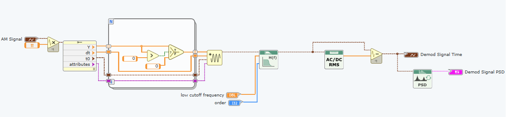

The AM signal is rectified with a loop block first to make any negative values 0. A waveform properties block is used to do this as it takes the waveform and makes its values into an array which is processed by the loop. The contents of the loop determines whether the input is greater than 0, if it lets it through and if not it sets the output to 0. The output of the loop is then used to build a waveform back from the positive values. This results in the formula $r(t)≈A_c+m(t)$. $A_c$ is just a DC value and can be removed by subtracting it as a DC offset.

**Why Scale by π at the start?**
The key reason for the π scaling is related to rectification and averaging effects in the envelope detector. When an AM signal is rectified (i.e., absolute value or diode-based detection), the carrier waveform gets modified.

For a pure cosine carrier:

$$
\cos(2\pi f_c t)
$$

the average value of its rectified waveform is:

$$
\frac{2}{\pi} A_c
$$

This happens because the mean value of a full-wave rectified sine wave is:

$$
\frac{2}{\pi} A
$$

Thus, if we take the rectified AM signal:

$$
r(t) = |s(t)|
$$

its average amplitude is scaled down by a factor of $ 2/\pi$.

## Exercise 2: AM Simulation

### Task 1: Add the block diagram to your logbook.

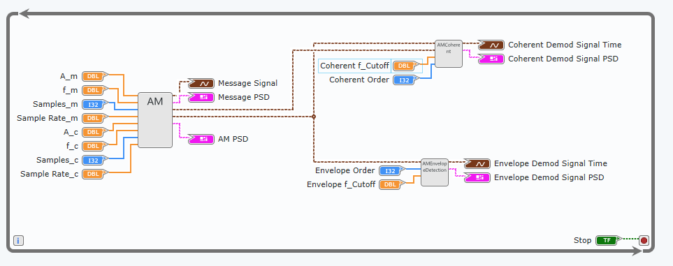

This shows the usage of sub VIs using the previously completed VIS as a submodule in this top module VI. A single tone signal is input to the modulator which executes AM and is then passed to both coherent and envelope demodulation modules.

### Task 2: Observe the time domain and PSD representations of the coherent and envelope demodulated signals as the message signal amplitude changes from 1 to 4 with steps of 1. As you change the message signal amplitude do you observe any changes between the two modulation techniques? If yes, explain the reason.

*$A_m=1$ graph results*
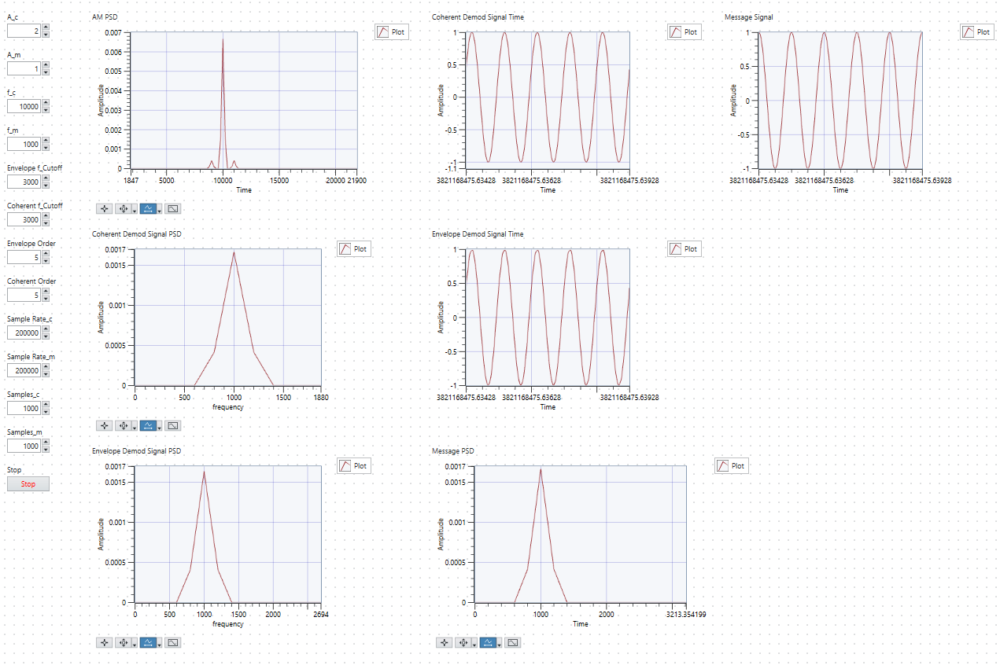

*$A_m=2$ graph results*
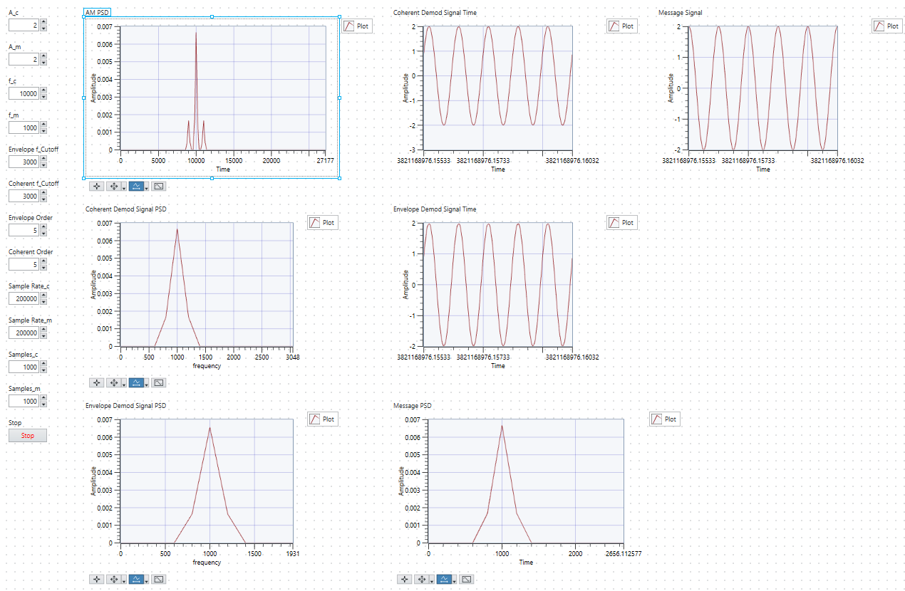

*$A_m=3$ graph results*
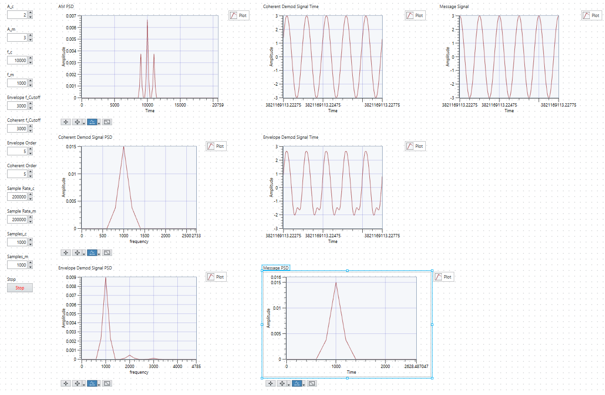

*$A_m=4$ graph results*
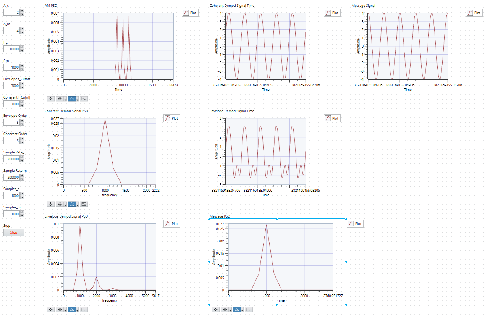

**For envelope demodulation**

The message amplitude increases while the carrier amplitude remains at 1. This results in overmodulation where $m>1$ and causes distortions inthe demodulated wave. This is due to the envelope crossing zero amplitude line, it inverts and produces the distortion in the envelope-detected output.

**For coherent demodulation**

The resulting graph is largely unchanged for coherent demodulation since it uses a carrier at the receiver synchronized in frequency and phase to the original carrier and multiplies it. This allows it to measure both positive and negative instantaneous amplitudes, preserving the linear relationship between modulating signal and output.

## Exercise 3: AM Communications via USRP

### Task 1: Run the code and explain in your logbook how the transmitter and receiver work. Hint: the USRP does all the modulation and demodulation on its own so the modules only needs to provide the complex data for the USRP to modulate. At the receiver the USRP will return the demodulated data.

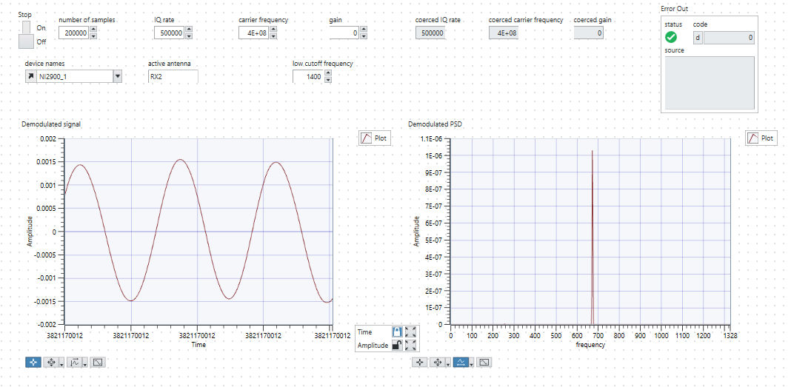

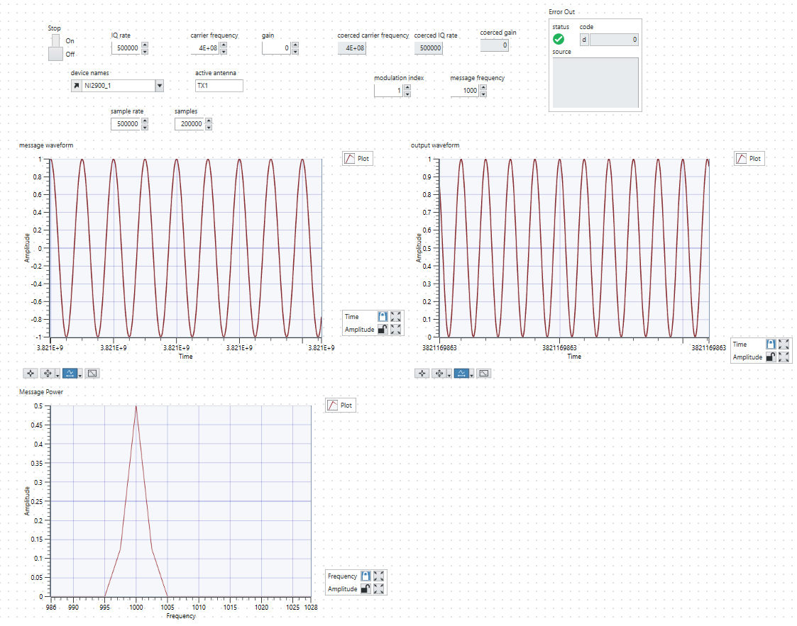

### Task 2: Transmit a single-tone message signal with frequency 5kHz and modulation index 1 (you may have to adjust the low cutoff frequency of the filter). Run the receiver, and plot the demodulated signal in time, and its PSD. Adjust the time and PSD plot to the relevant region so that the plot is not just a blur, and rename the axes appropriately. Add the plots to your logbook.
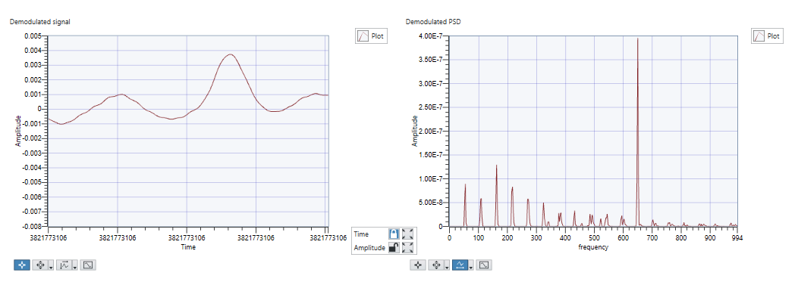
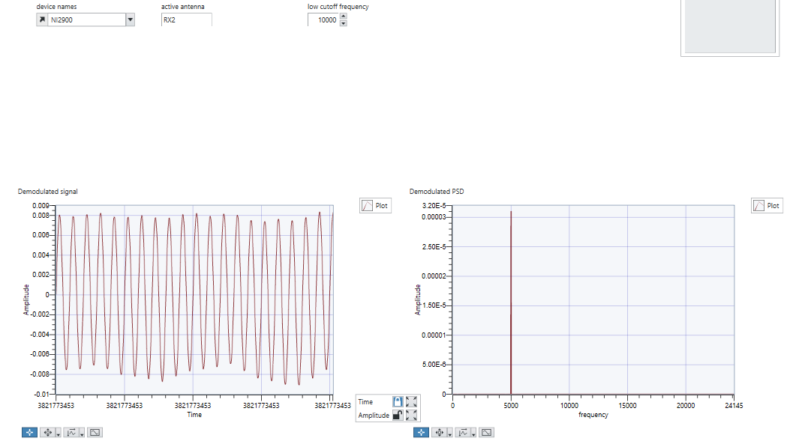

### Task 3: To observe the effect of noise in the demodulated signal, increase the receiver’s gain to 20 dB (your receiver will start to detect other weaker signals in addition to the transmitted signal), and adjust the X axis of the demodulated message (in time domain) to show values between 0 second (s) and 0.004 s. Then, change the modulation index (𝜇) value and observe the effects on the plots of the demodulated signal in both time and frequency. From what value of 𝜇 can noise be clearly noticed in the plots? Copy the image of the noisy demodulation into your logbook.

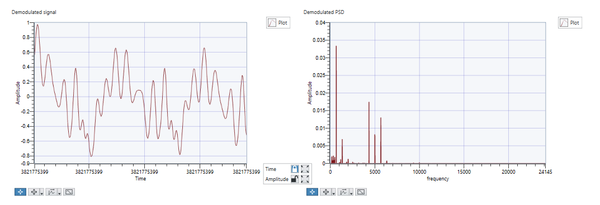
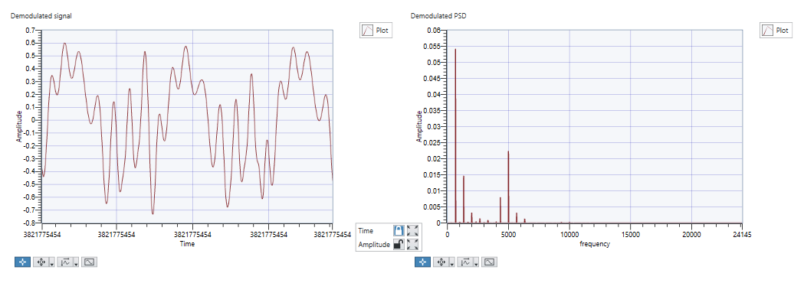
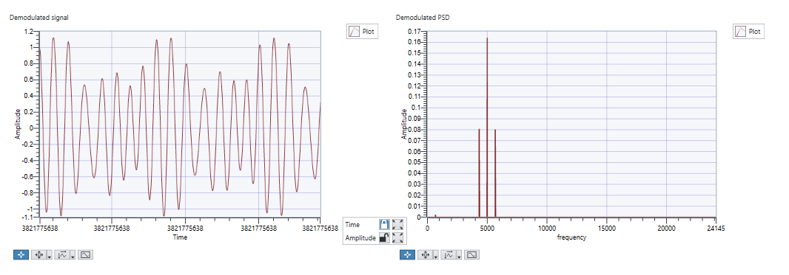

# Lab 3

## Exercise 1: FM Modulator

In frequency modulation (FM), the information in the message signal is conveyed through variations in the frequency of the modulated carrier signal. The general expression for an FM signal is:

$$s(t) = A_c \cos(2\pi f_c t + \theta_m(t))$$

where

$$\theta_m(t) = 2\pi k_f \int_{0}^{t} m(\tau) d\tau,$$

$m(t)$ represents the message signal, and $k_f$ is the frequency sensitivity. The instantaneous frequency of the modulated signal is given by:

$$f_i = f_c + k_f m(t)$$

An equivalent expression for the FM signal is:

$$s(t) = A_c \cos(2\pi f_c t) \cos(\theta_m(t)) - A_c \sin(2\pi f_c t) \sin(\theta_m(t))$$

The figure below illustrates a message signal (left) and its corresponding FM-modulated waveform (right). The modulation results in a varying frequency over time.

The frequency deviation is given by:

$$\Delta f = k_f m_f$$

where $m_f = \max |m(t)|$ represents the peak value of the message signal. The modulation index, which describes the extent of frequency variation relative to bandwidth, is defined as:

$$\mu = \frac{\Delta f}{B}$$

where $B$ denotes the message bandwidth. 

### Task 1: Set the parameters as in the following table and observe the changes in the modulated signal. 

| Parameter                     | Value           |
|--------------------------------|---------------|
| Message signal frequency       | 1 kHz         |
| Carrier signal frequency       | 10 kHz        |
| Sample rate                    | 200k          |
| Samples                        | 1k            |
| \( k_f \)                      | [500, 2000, 5000] |
| Message signal amplitude       | 1             |
| Carrier signal amplitude       | 1             |

There are differences in the time domain and frequency domain graphs of the demodulated wave result.

### Task 2: Explain the resulting changes in the FM signal and its PSD as you change $\Delta_f$. Add the graphs of the FM signal and its PSD to your logbook for different $\Delta_f$.

**Graphs for $k_f=500$**
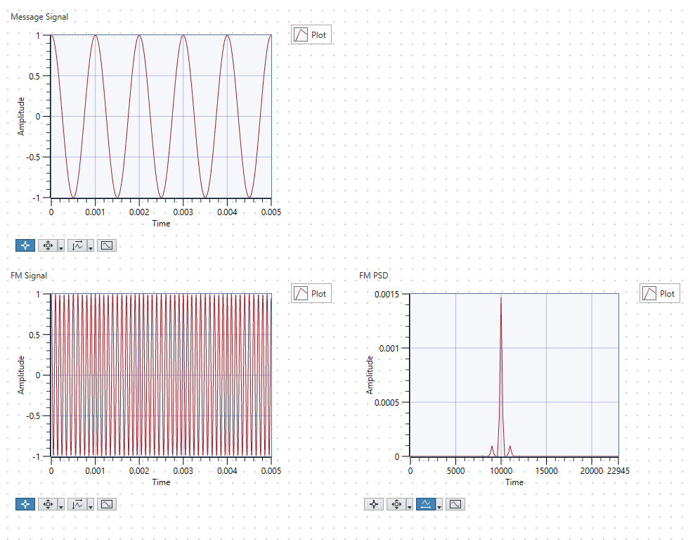
The FM signal here looks consistent and resembles the original carrier wave where the frequency sensitivity is smaller, $k_f=500$. There are three peaks, one of them being very large.

**Graphs for $k_f=2000$**
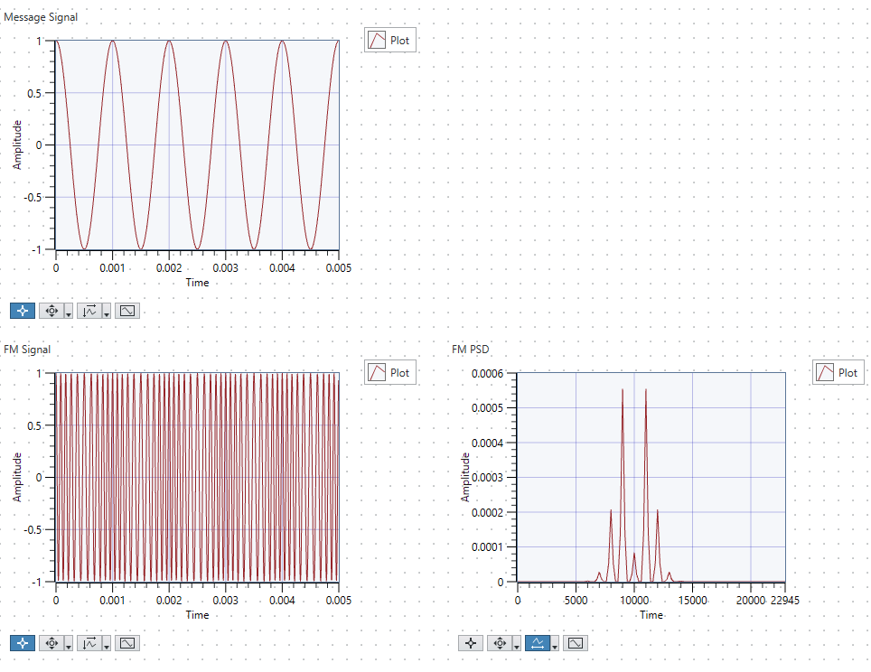
A little more frequency variation can be seen in the FM signal. More peaks are seen as the sidebands involved in FM get more significant and their power distribution is bigger.

**Graphs for $k_f=5000$**
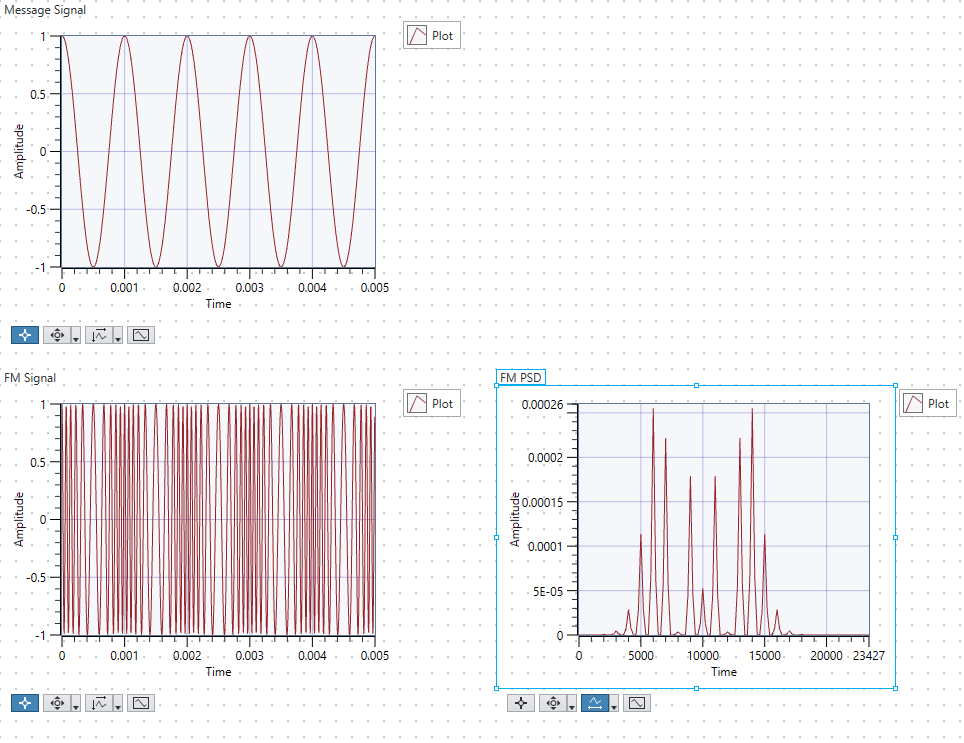

For Δf = 500Hz

$$
μ = Δf / B = 500 / 1000 = 0.5
$$

For Δf = 2000Hz

$$
μ = Δf / B = 2000 / 1000 = 2
$$

For Δf = 5000Hz

$$
μ = Δf / B = 5000 / 1000 = 5
$$

When the frequency sensitivity is very high, there are rapid and large frequency variations in the time domain. The oscillations become more compressed and stretched as the frequency sweeps faster. The number of spectral peaks increase with a high $k_f$ and the signals energy is distributed among many frequencies.

**Observations about Frequency Modulation (FM)**

- As frequency deviation ($\Delta f$) increases, the density of the FM signal in the time domain becomes more spread out.  
- A larger $\Delta f$ also widens the FM signal’s power spectral density (PSD) bandwidth.  
- Carson’s rule estimates the FM bandwidth as $B_{FM} \approx 2 (\Delta f + B)$ where $B$ is the highest modulating (message) frequency. 

### Task 3: Include the block diagram of your FM_Modulator.gvi in your logbook.

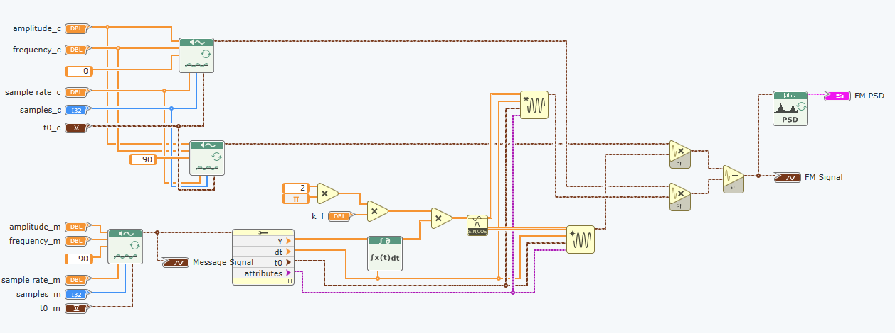

The circuit executes the equations written above for FM:

$$\theta_m(t) = 2\pi k_f \int_{0}^{t} m(\tau) d\tau,$$
$$s(t) = A_c \cos(2\pi f_c t) \cos(\theta_m(t)) - A_c \sin(2\pi f_c t) \sin(\theta_m(t))$$

A waveform generator takes in the paramaters for a wave and generates the signal according to the parameters. The integral of the message signal is taken with the integral block after using a waveform properties block which allows processing by theintegral block. Then $2\pi k_f$ is multipled to generate the time varying phase term $\theta_m(t)$. For the second equation shown, the phase term has to be multiplied by the carrier wave and summed with another phase term mutlipled by the carrier wave with a 90 degree phase difference().

## Exercise 2: FM Demodulator

### Task 1: Explain briefly the mathematical theory behind this demodulation technique.

**Frequency Modulation (FM) Overview**

In FM, the instantaneous frequency of the carrier is varied according to the message signal $m(t)$. The FM signal can be expressed as:

$$
s_{FM}(t) = A_c \cos \left( \omega_c t + k_f \int m(t) dt \right)
$$

where:
- $A_c$ is the carrier amplitude,
- $\omega_c$ is the carrier angular frequency,
- $k_f$ is the frequency sensitivity of the modulator,
- $m(t)$ is the message signal.

The instantaneous frequency $f_i(t)$ is given by:

$$
f_i(t) = \frac{1}{2\pi} \frac{d}{dt} \left( \omega_c t + k_f \int m(t) dt \right) = f_c + \frac{k_f}{2\pi} m(t)
$$

where $f_c = \frac{\omega_c}{2\pi}$ is the carrier frequency.

**Frequency Discrimination Approach**
FM demodulation using frequency discrimination involves two steps:

1. **Differentiation:**  
   The FM signal is differentiated to convert frequency variations into amplitude variations. Mathematically,

   $$
   \frac{d}{dt} s_{FM}(t) = -A_c \sin \left( \omega_c t + k_f \int m(t) dt \right) \cdot \left( \omega_c + k_f m(t) \right)
   $$

   The result is an amplitude-modulated signal where the envelope is proportional to the instantaneous frequency.

2. **Envelope Detection:**  
   Since the differentiated signal is an AM signal (containing both FM and AM components), an envelope detector is used to extract the amplitude, which corresponds to $m(t)$.

   The final recovered message signal is:

   $$
   m(t) \approx \frac{1}{k_f} \left( f_i(t) - f_c \right)
   $$

This method effectively converts frequency variations into amplitude variations, which can be easily extracted using an envelope detector.

### Task 2: Add the block diagram to your logbook.

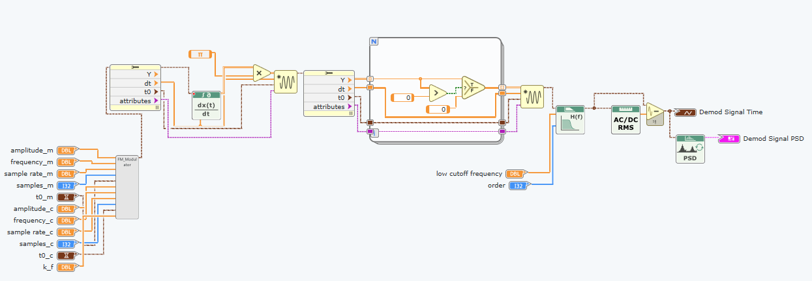

A differentiation block is used to obtain an AM signal which has FM components too. 

1. Differentiate $ s(t) $:

   $$
   \frac{d}{dt} s(t) = -A_c \sin \left( 2\pi f_c t + \theta_m (t) \right) \cdot \left( 2\pi f_c + 2\pi k_f m(t) \right)
   $$

2. The envelope detector eliminates the sinusoidal component and negative amplitudes, similar to AM demodulation, leaving:

   $$
   -A_c \left( 2\pi f_c + 2\pi k_f m(t) \right)
   $$

3. A low-pass filter removes any residual high-frequency components, resulting in:

   $$
   -A_c \ 2\pi k_f \ m(t)
   $$

4. To retrieve $ m(t) $, the output must be scaled appropriately by dividing by the constant $ -A_c \ 2\pi k_f $. 

The block diagram does not show this division as we missed this part and the picture was taken earlier.

## Exercise 3: FM Simulation

### Task 1: Add the block diagram to your logbook.

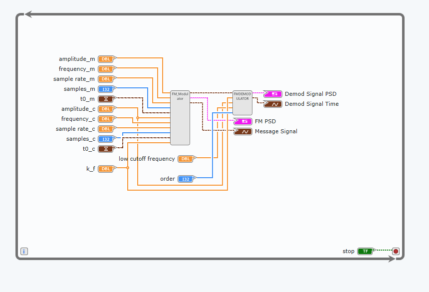

Integration of modulation and demodulation subVIs.

### Task 2: Set the parameters as in the above table. Observe the demodulated signal and attach the plots of the FM signal and the demodulated signal with their corresponding PSDs to your logbook (for the demodulated signal, you should also provide a zoomed version, without the initial transient, so that it is easy to observe the amplitude of the message).

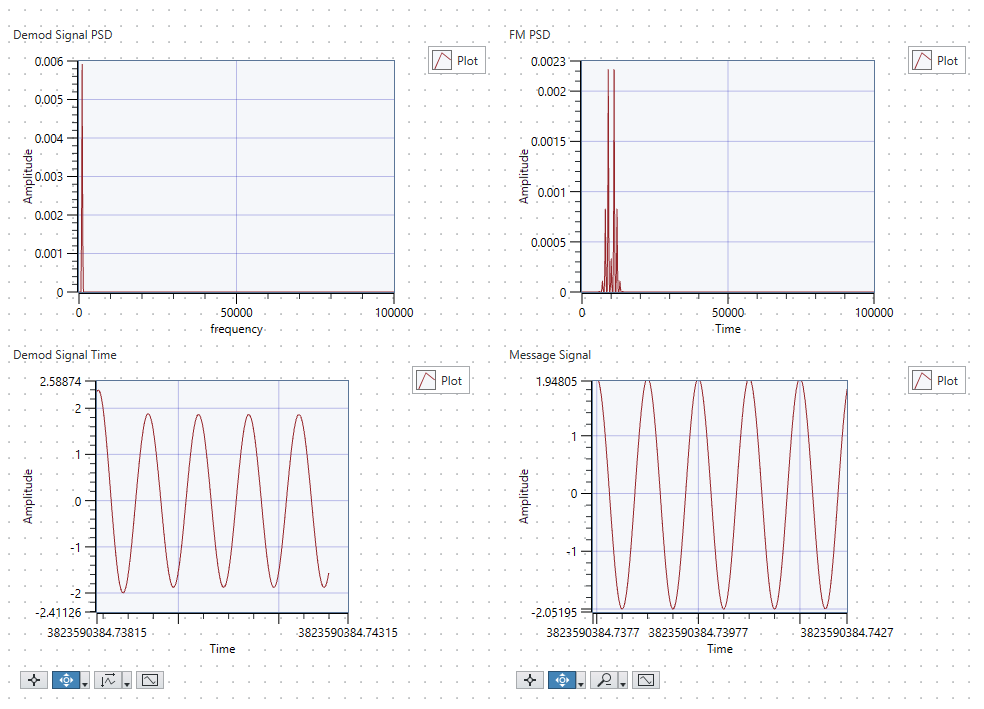

The demoulated wave looks very similar to the original message wave barring the intial transient which could perhaps be due to the low pass filter in demodulaiton if it were not critically damped.

## Exercise 4: FM Communications via USRP

### Task 1: Add the power spectrum graph for each of these cases into your logbook. Be sure to scale the horizontal axis so that each spectrum is visible clearly. Annotate your spectra to show the FM signal bandwidth (Carson’s rule). 

**Frequency Deviation = 1khz**
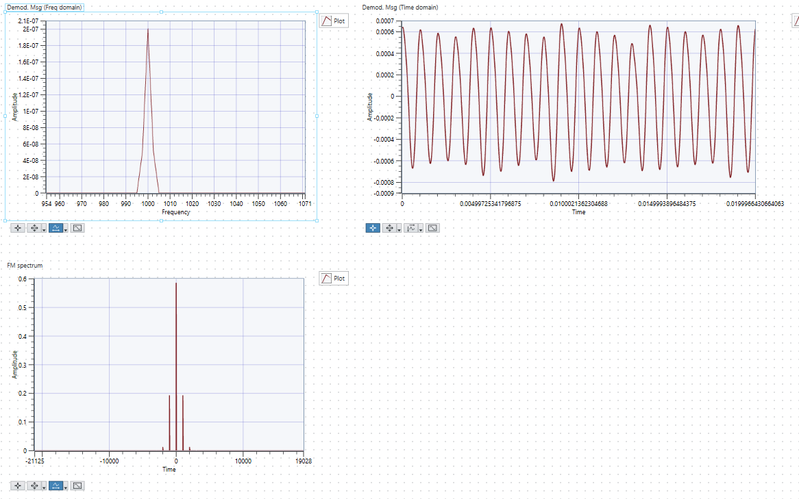

**Frequency Deviation = 5khz**
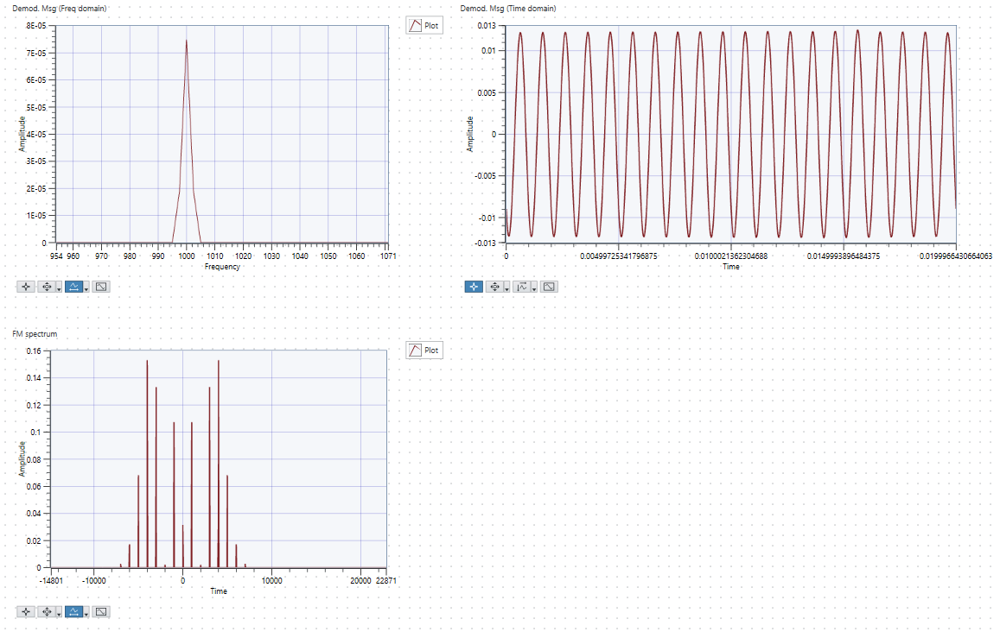

**Frequency Deviation = 30khz**
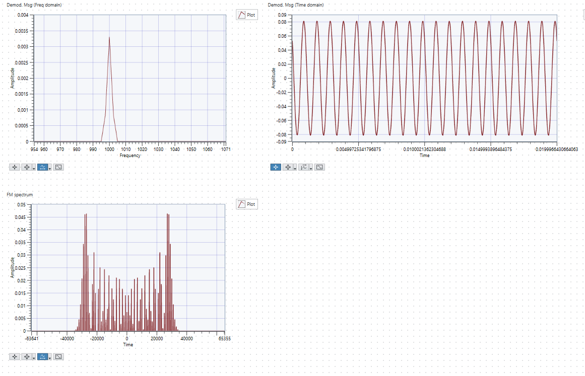

## Lab 4 - Binary Phase Shift Keying (BPSK) via USRP

In phase-shift keying (PSK) modulation, information is encoded on the phase of the transmitted carrier rather than on its amplitude (ASK) or frequency (FSK).

In binary phase-shift keying (BPSK), there are two phase values: $0 \degree$ or $180 \degree$; i.e. an unmodified carrier is transmitted to represent one binary data value, whilst an inverted carrier is transmitted to represent the other. BPSK is optimum among binary modulation schemes in achieving the lowest average power for a given target bit error ratio (BER).

---

### Exercise 1 - BPSK Transmitter

The BPSK signal is given by the equation:

$$ A g_{TX}(t)\cos(2\pi f_c t + \theta (t)) $$

where $A$ is a constant corresponding to the transmitted power level, $g_{TX}(t)$ is a fixed pulse shape, $f_c$ is the carrier frequency and $\theta(t)$ takes the value of either $0\degree$ or $180\degree$ to carry the desired information. Therefore, the equation can be rewritten as:

$$ \pm A g_{TX}(t)\cos(2\pi f_c t)$$

since $\cos(\theta + 180\degree)=-\cos(\theta)$.
We assume a new pulse is transmitted every $T$ seconds so that the symbol rate is $1/T$.

To form a BPSK signal, we first need to map the input data (a stream of bits) to symbols. The **MT Generate Bits** VI produces an array of bits from the input stream. We map the bits to the symbols in this way:

| Bit Value | Phase ($\theta$) | Symbol |
|-----------|------------------|--------|
| 0         | 0                | -1     |
| 1         | 180              | 1      |

In our case, this mapping follows the equation:

$$ s[n] = 2 b[n] - 1 $$

Also, the symbol rate and bit rate are the same in this case as each symbol represents exactly one bit (0 or 1) and since there are only two symbols (-1 and 1), these are the same.

We then do the upstampling step. This increases the sample rate before pulse shaping by placing $L-1$ zeros after each symbol.
This therefore produces a sample interval of:

$$ T_x = \dfrac{T}{L} $$

or a sample rate of 

$$ \dfrac{1}{T_x}=L \dfrac{1}{T} $$

The quantity $L$ is known as the **upsampling factor**.

Next, we do the pulse shaping step. The aims to smooth out transitions between symbols and involves passing the upsampled signal through a root-raised cosine filter. When we do this, each discrete symbol is spread out in time to form a smooth RRC pulse. The RRC pulse has a rapid spectral roll-off, which means most of the signal's energy is confined within a narrow band, which helps to limit the bandwidth of the transmitted signal and reduce interference with consecutive symbols (avoid inter-symbol interference). 

We finally send the signal in the form $(\pm 1+0j)g_{TX}[n]$ directly to the USRP. The USRP can then do the digital-to-analogue conversion and upconversion (multiplying by the carrier $\cos(2 \pi f_c t)$) which are necessary steps to convert the digital baseband signal into a real analogue RF signal.

First, we added the **MT Generate Bits** module which creates a pseudorandom sequence of bits fo tthe BPSK system. We added a control to specify the total number of bits.

We then performed the symbol mapping, implementing this basic equation:

$$ s[n] = 2 b[n] - 1 $$

 We then include the **AddFrameHeader** sub-VI after this. This module inserts a specific 26-bit sequence at the start of the transmission, which is used to align the recieved bits. This is needed because the receiver doesn't inherently know where the first bit of the message start. This 26-bit header is then found at the receiver and is cut off (along with any bits before the frame header) which were just noise or misaligned data.

We then upsample the array of symbols using the **Upsample** module. We use the symbol rate $\frac{1}{T}=10,000$ (which is the symbols per second) and the IQ rate $\frac{1}{T_x}=200,000$ (which is the samples per second) to calculate the upsampling factor:

$$L=\dfrac{\text{IQ Rate}}{\text{Symbol Rate}}=\dfrac{\frac{1}{T_x}}{\frac{1}{T}}=\dfrac{T}{T_x}=\dfrac{200,000}{10,000}=20$$

This means each symbol is represented by 20 samples.

We then added a **MT Generate Filter Coefficients** module to generate the pulse-shaping filter and this is convolved using the **Convolution** module to to apply this filter to the unsampled symbols.

We then normalised the amplitude of the filtered message to a maximum absolute value of 1, presumably to prevent clipping or distortion. Next, we added the **Build Waveform** function and connected the normalised signal as in input to this. 

We also set the $dt$ value (which is the sampling time interval) to $\frac{1}{\text{IQ Rate}}=\frac{1}{200,000}=5\mu \text{s}$. We then placed an indicator at the output to observe the BPSK-modulated baseband waveform.

We then convert the the output of the normalised signal to complex values as this is what the USRP requires for transmission. Of course in BPSK, the imaginary part is 0, but this still needs to be formatted in this way.

We also wanted to observe the baseband power spectrum. But first, we had to connect our normalised signal to a **Cluster Properties** module (this organises and formats the data points to prepare the signal for FFT processing by ensuring it has the correct data type (Complex Double: CDB), the correct $dt$ time spacing and other formatting). 

We also added the **Insert Pilots** sub-VI which inserts a specific sequence of symbols, which helps the receiver estimate and correct channel distortions. We then add another frame header (complex, this time) to mark the start of transmission. We finally connect to **niUSRP Write Tx Data** which sends the complex BPSK signal to the USRP hardware for actual transmission.

This was our completed block diagram:
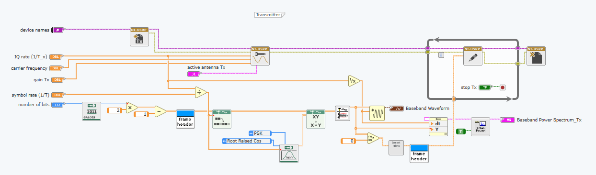

In the panel, we then assigned these values as shown:
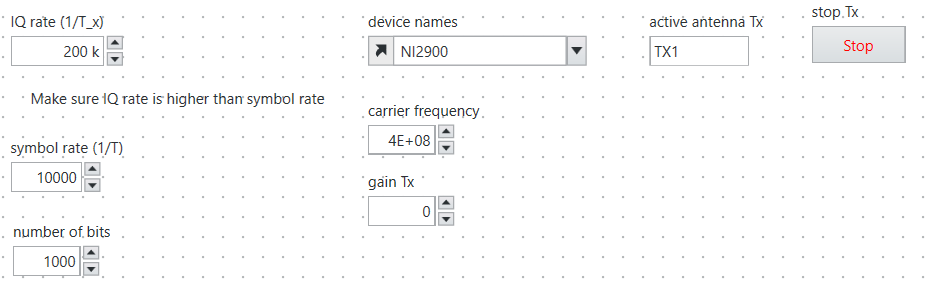

Clearly, given the symbol rate $\frac{1}{T}=10,000$ and the IQ rate $\frac{1}{T_x}=200,000$, the number of samples per symbol, or the upsampling factor 

$$L=\dfrac{\text{IQ Rate}}{\text{Symbol Rate}}=\dfrac{200,000}{10,000}=20$$

These were the plots we obtained.

Baseband Waveform:
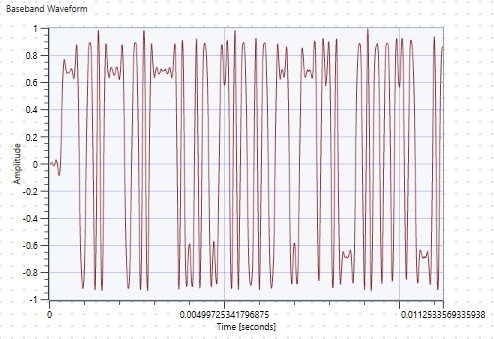

Baseband Power Spectrum:
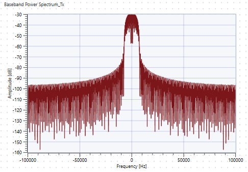

From the baseband waveform plot, we can see that the waveform resemble pulses, either +1 or -1. Also, given that we used root-raised consine pulse shaping, we have smooth transitions between pulses, avoiding any sharp edges. From the power spectrum, we see that the spectral roll-off is very sharp since we are using root-raised cosine filtering. This means the majority of the energy is spread within the main lobe.

Zooming in on the main lobe, we can measure the main lobe bandwidth:

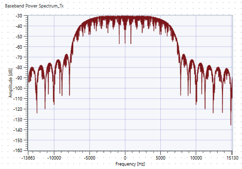

We see that the main lobe has a bandwidth of approximately $14\text{kHz}$.

We then changed the pulse shaping filter control to 'None' to create rectangular pulses and we observed these plots:

Baseband Waveform:
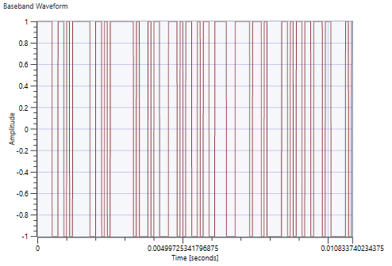

Baseband Power Spectrum:
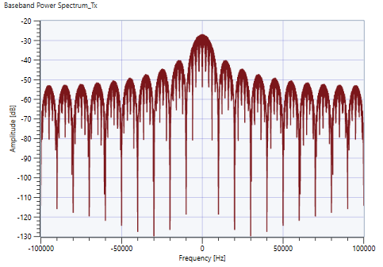

Looking at the baseband waveform, we now get perfect rectangular pulses at +1 or -1. From the power spectrum, we see that the spectral roll-off compared to the root-raised cosine is much more gradual and much less sharp.

Zooming in as before, we can measure the bandwidth of the main lobe:

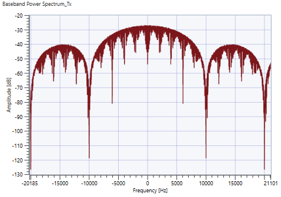

And the bandwidth of the main lobe is now $20\text{kHz}$ which is significantly more than with the root-raised cosine.

The root-raised cosine is designed to minimise inter-symbol interference (ISI) and hence has a sharp spectral roll-off and a narrower bandwidth.

---

### Exercise 2 - BPSK Receiver

The BPSK signal that arrives at the receiver is given by:

$$ r(t)=\pm Dg_{TX}(t) \cos(2\pi f_c t + \varphi) $$

where $D$ is a constant (usually smaller than A, as the received signal will be attenuated) and $\varphi$ represents the difference in phase between the transmitter and receiver carrier oscillators. 

Assuming the receiver's carrier oscillator is set to the same frequency as the transmitter, then the USRP receiver does the majority of the work in demodulating the BPSK signal. It is demodulated by multiplying it with the receiver's carrier oscillator signal $\cos(2 \pi f_c t)$:

$$ r_{demod}(t)=r(t)\cdot \cos(2\pi f_c t)=Dg_{TX}(t) \cos(2\pi f_c t + \varphi)\cos(2\pi f_c t)$$

$$ r_{demod}(t)=Dg_{TX}(t)\cdot \dfrac{1}{2}[\cos(4\pi f_c t + \varphi) + \cos(\varphi)]$$

where we have used trigonometric identities to simplify.

The term $\cos(4 \pi f_c t + \varphi)$ is a high-frequency component which would be filtered out by a LP filter, giving:

$$ r_{baseband}(t)=\dfrac{D}{2}g_{TX}(t)\cos(\varphi)=\dfrac{D}{2}g_{TX}(t)e^{j\varphi}$$

It is then sampled at intervals $T$ and the $\pm$ comes from the BPSK modulation: $+\frac{D}{2}$ for symbol "$1$" and $-\frac{D}{2}$ for "$-1$".
 
Therefore the receiver's **Fetch Rx Data** function provides this sequence of output samples, given by:

$$ \tilde{r}[n]=\pm \frac{D}{2}g_{TX}[n]e^{j\varphi} $$

Similar to the transmitter, the sampling rate $\frac{1}{T_z}$ is set by the receiver's **IQ Rate** and this rate is set so as to provide $M$ samples every $T$ seconds, where $\frac{1}{T}$ is the sample rate.

To obtain the transmitted signal, we first need to do **Channel Estimation** to remove the phase ambiguity caused by the unsynchronised transmitter (Tx) and receiver (Rx) oscillators. It works by reading the received pilots (known symbols) which we inserted in the Tx signal, and comparing these with the expected ones to estimate the channel transfer function using a least-squares estimation. The inverse of the transfer function is then applied to the Rx signal to try to remove the phase offset.

We then perform matched filtering, which serves to maximise the SNR and reduce the inter-symbol interference (ISI). We use a root-raised cosine filter, and the impulse response $g_{RX}[n]$ is matched to the pulse shape $g_{TX}[n]$ of the transmitted signal.

The matched filte routput is an analog baseband signal that needs to be sampled once every $T$ seconds, i.e. once per symbol time. Due to propagation delays, the filtering and channel distortion, we have to determine the optimal sampling instants to take the samples and this is achieved by the **PulseAlign** sub-VI.

The **Decimate** module then samples the aligned baseband waveform at index 0 and every $T$ seconds thereafter. This is the process of **downsampling** the baseband signal to extract one sample per symbol period $T$. The input to the Decimate function is a high-rate signal (i.e. $M \times$ the symbol rate, where $M$ is the matched samples per symbol or the decimation rate). For example, if our input samples are $x[0], x[1], x[2], x[3], x[4], x[5], ...$ and we have a decimation factor $M=4$, out output samples will be $x[0], x[4], x[8], ...$.

Finally, once we have sampled the baseband waveform, each sample must be examined to determine whether it represents the symbol $1$ or $-1$. These detected symbols are then converted to bits by carrying out the opposite of the calculation we did in the transmitter:

$$ b[n] = \dfrac{s[n] + 1}{2}$$

Alternatively, a **Greater than 0?** function also works.

To actually implement this, we first added a **FrameSync (Complex)** module. This synchronises the receiver to the transmitted signal by detecting the header (26-bit sequence) that was added in the AddFrameHeader sub-VI in the transmitter. It then discards the header (along with any bits before the frame header) which is just noise or misaligned data. This ensures the receiver starts processing the actual transmitted data. This module is the complex version as the received signal is complex-value (contains in-phase and quadrature copmonents, both of which are necessary to fully characterise the amplitude and phase of the signal). 

We then connected the output of this to the channel estimator which estimates the phase offset using the pilot symbols that we inserted into the Tx signal, estimates the channel transfer function and then applies the inverse of this to align the received signal to the transmitted signal. 

To implement the matched filter, we used the **MT Generate Filter Coefficients** block as in the transmitter, where the filter coefficients are for a root-raised cosine filter. We also input the matched samples per symbol, or downsampling factor $M$ to this function. This is calculated using the symbol rate $\frac{1}{T}=10,000$ (which is the symbols per second) and the IQ rate $\frac{1}{T_z}=200,000$ (which is the samples per second):

$$M=\dfrac{\text{IQ Rate}}{\text{Symbol Rate}}=\dfrac{\frac{1}{T_z}}{\frac{1}{T}}=\dfrac{T}{T_z}=\dfrac{200,000}{10,000}=20$$

Notice that this is the same value as the upsampling rate in the transmitter (obviously).

We then extract the real part of the output of the **Channel Estimator** block. We are no longer interested in the quadrature (imaginary) component as after demodulation and phase correction, the signal is primarily real-valued and the Q component is either 0 or just contains noise. This is then convolved with the filter coefficients.

To observe the baseband power spectrum, we connect the output of the convolution to a **Cluster Properties** module (this organises and formats the data points to prepare the signal for FFT processing by ensuring it has the correct data type (Complex Double: CDB), the correct $dt$ time spacing and other formatting). The $dt$ value (which is the sampling time interval) is set to $\frac{1}{\text{IQ Rate}}=\frac{1}{200,000}=5\mu \text{s}$. We then placed an indicator at the output to observe the baseband power spectrum.

We then connect the baseband output waveform (output of convolution function) and the downsampling factor $M$ to a **PulseAlign (Real)** module (since our signal is now real-valued) which aligns the signal to the optimal sampling instants. The aligned waveform can then be downsampled to one sample per symbol using the **Decimate** function, where the decimating factor is the downsampling factor $M$. Another **FrameSync (Real)** module is added to check that the sampled symbols are aligned with the transmitted data.

We then need to determine if each symbol is a 1 or a 0. This was done using a for loop. The **Greater than 0?** module maps each symbol ($-1$ or $1$) to a boolean value which can then be converted to corresponding bits ($0$ or $1$). This is then converted to an integer array of size 1000 bits (this is the length of the message).

Finally, we calculate the BER using the **MT Calculate BER** function by comparing the detected bits to the expected bits. It calculates the radio of incorrect bits to total bits. The trigger threshold is set to 0.4, which means that the receiver is considered to be synchronised if the measured BER is less than 40%. If the measured BER is above the threshold, the **trigger out?** output remains false, suggesting that the receiver is not synchronised.

This was our completed block diagram:

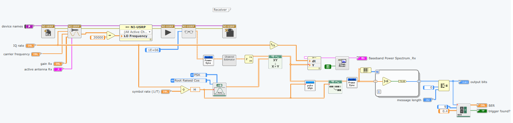

And these were the values we specified in the panel:

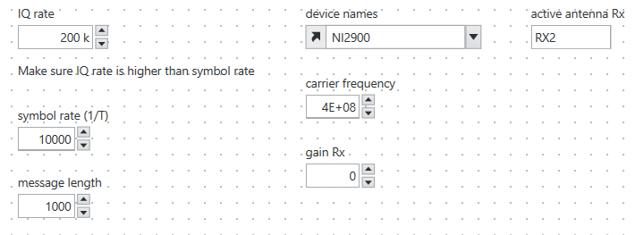

We then ran the transmitter and receiver several times at these different gain values:

| Tx Gain(dB) | Rx Gain (dB) |
|-------------|--------------|
| 0           | 0            | 
| -35         | -15          |
| -37         | -15          |
| -40         | -15          |

The Tx gain controls the power of the transmitted signal. The lower the Tx gain, the lower the signal power making it more susceptible to noise.

The Rx gain amplifies the received signal. Lower Rx gain reduces the signal power at the receiver, increasing the impact of noise.

We are essentially trying to maximise the SNR (ratio of signal power to noise power). This higher the SNR, the lower the BER.

We would therefore expect for the high Tx and Rx gain (Tx gain $=0$ and Rx gain $=0$) to have a high SNR as both the transmitted and recieved signals are at their maximum power and so we should get a low BER.

Decreasing the Tx gain to $-35$ and the Rx gain to $-15$, the power of the transmitted signal is reduced and the received signal has a lower amplification. We therefore expect both signals to be attenuated, and so we expect the SNR to be lower than in the first case with a resulting higher BER.

Decreasing the Tx gain further we would expect a worse BER still.

The results we obtained were as follows:

| Tx Gain(dB) | Rx Gain (dB) | Reading 1 | Reading 2 | Reading 3 | Reading 4 | Reading 5 | Average BER |
|-------------|--------------|---|---|---|---|---|---|
| 0           | 0            | 0 | 0|0 |0 |0 |0 |
| -35         | -15          | 0.00737101 | 0.0221998|0.0201806 |0.00364964 | 0.00403633| 0.0114877| 
| -37         | -15          |  0.0246154| 0.0960699| 0.043573| 0.0813008| 0.0952381| 0.0681594|
| -40         | -15          |0.317511  |0.1963 |0.184694 |0.480789 |0.491264 |0.334112 |

As expected, the average BER increases as the Tx and Rx gain decrease. At Tx and Rx gain $=0$, the signal is strong enough that we get no errors at all! 

We also see that the variation in readings increases as the gain decrease, which is also expected as the system is operating closer to the threshold where communication is unreliable, where the SNR is very low.

## Exercise 3: Differential Phase Shift Keying (DPSK)

### Task 1: Add the block diagram of your DPSK system to your logbook

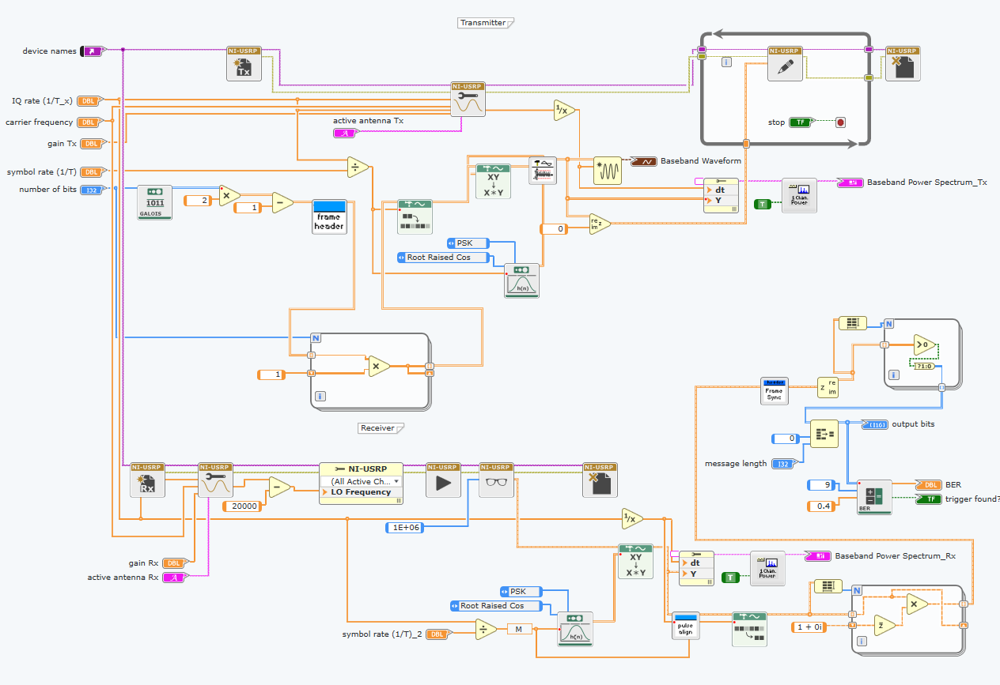

To implement the DPSK system, we started by duplicating our BPSK transmitter and receiver. In the transmitter, we added a differential encoder after the AddFrameHeader function to encode both the frame header and symbols. We then removed the Insert Pilots and AddFrameHeader(Complex) functions, converting the Quick Scale 1D output directly into complex values before feeding it to niUSRP Write Tx Data.

On the receiver side, we removed the Channel Estimator and Frame Sync (Complex) functions, connecting the received data directly to Convolution (CDB) while ensuring proper signal handling with PulseAlign (Complex) and FrameSync (Complex). Finally, we placed a differential decoder after the Decimate function and before FrameSync (Complex) to correctly decode the received symbols, streamlining the DPSK system.

### Task 2: Run your code several times using the initial configuration used for the BPSK system. Explain your observation(s) on the BER performance of the system.

**Graph for $rxgain=0, txgain=0$**
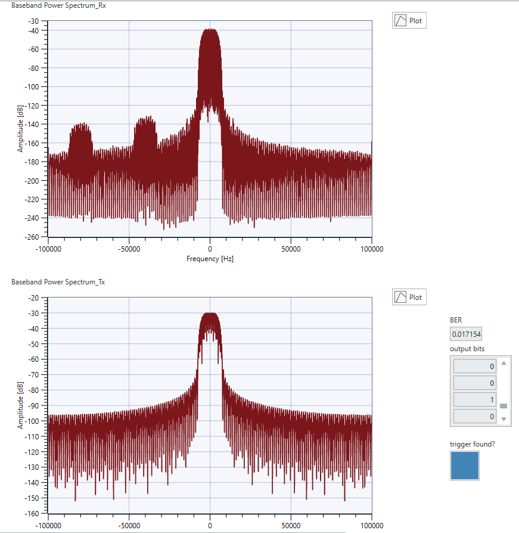

**Graph for $rxgain=-15, txgain=-35$**
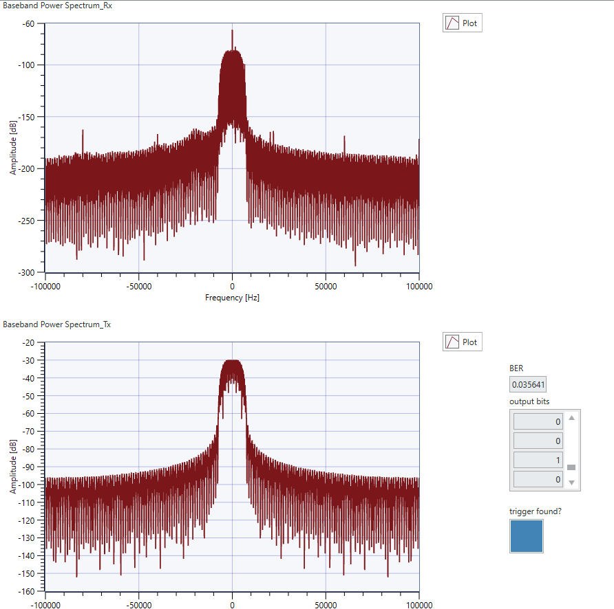

**Graph for $rxgain=-15, txgain=-37$**
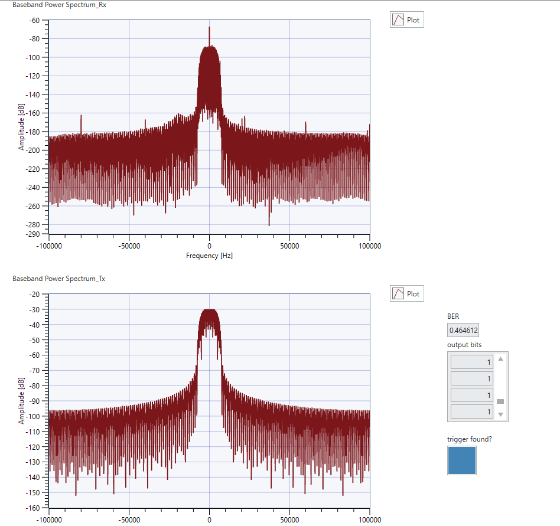

**Graph for $rxgain=-15, txgain=-40$**
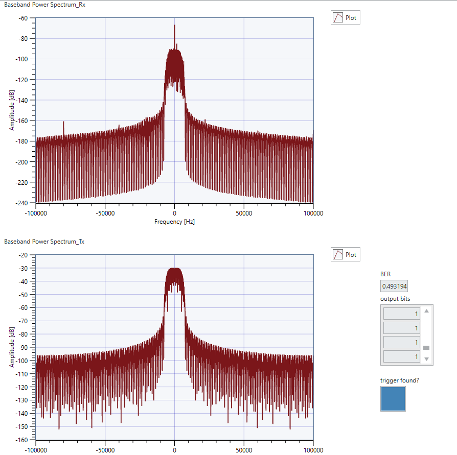

**BER values table**

| Gain Values                 | BER Trial 1 | BER Trial 2 | BER Trial 3 | BER Trial 4 | BER Trial 5 |
|-----------------------------|------------|------------|------------|------------|------------|
| $rxgain=0, txgain=0$        | 0.017154   | 0.019283   | 0   | 0   | 0   |
| $rxgain=-15, txgain=-35$    | 0.392181   | 0.411292   | 0.034892   | 0.367812   | 0.498827   |
| $rxgain=-15, txgain=-37$    | 0.464612   | 0.129384   | 0.461892   | 0.468723   | 0.466589   |
| $rxgain=-15, txgain=-40$    | 0.493194   | 0.498752   | 0.382412   | 0.495612   | 0.494389   |

| Gain Values                 | Average BER |
|-----------------------------|------------|
| $rxgain=0, txgain=0$        | 0.007287   |
| $rxgain=-15, txgain=-35$    | 0.341001   |
| $rxgain=-15, txgain=-37$    | 0.406240   |
| $rxgain=-15, txgain=-40$    | 0.472872   |

The average BER values for DPSK are significantly higher than the average BER values for BPSK.

### Task 3: Compare the performance of BPSK and DPSK, and explain your findings.

The BPSK results had overall lower BER values as it is a coherent detection method and can have a low BER when it has an accurate reference carrier signal to demodulate. 

DPSK encodes information in the difference between successive symbols. The differential detection process makes DPSK inherently more susceptible to noise, because any noise in the previous symbol can degrade the detection of the current symbol. This may result in an error propagation resulting in about a 3 dB performance loss relative to coherent BPSK.

